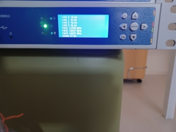
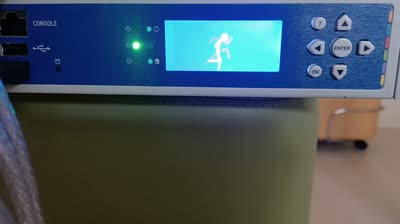

# NAME

text2lcd

bmp2lcd

Version 0.0.2

# SYNOPSIS

    stty -F/dev/ttyS1 raw clocal speed 115200

    perl text2lcd "some text that will be displayed IN UPPER CASE unfortunately"
    
    convert -pointsize 11 -size 128x64 -font "Arial" -background white -fill black label:"some text\nsome more text" -monochrome /path/to/lcd.bmp
    perl bmp2lcd /path/to/lcd.bmp

# DESCRIPTION

A simple interface for writting to the LCD screen on Checkpoint 12200
(EZIO-G500) 

# Revision History

    0.0.1
           Initial Release
    0.0.2
           Added underscore to characters and some examples

# DEPENDENCIES

well, I haven't written a real BMP parser, so you need to convert from ImageMagick, whose offsets are currently 
hard-coded

I also haven't gotten around to setting the serial port to a usable state, so use stty on Linux to do so

# SEE ALSO

All the actual work was done by Saint-Frater and published on [https://git.nox-rhea.org/globals/reverse-engineering/ezio-g500](https://git.nox-rhea.org/globals/reverse-engineering/ezio-g500)

# CAVEATS

Lots. Only tested on Checkpoint 12200 on Linux

Should probably rewrite in C or Rust

# BUGS

Probably lots.

# ACKNOWLEDGEMENTS

Saint-Frater for doing the serial capture and deciphering most of the protocol

# EXAMPLES

The examples subdirectory contains some stuff that I managed to do with the scripts
along with the sensors configuration that was used to produce the results

The sensors got displayed like so:

    sensors | egrep 'Core|fan|board' | sed 's/ [(].*$//' | sed 's/+//' | sed 's/  */ /g' |  tr -d [°]  | /usr/local/bin/text2lcd

This animation was produced with this sily little bash script:

    while true
    do 
        /usr/local/bin/bmp2lcd animation/a1.bmp
        /usr/local/bin/bmp2lcd animation/a2.bmp 
        /usr/local/bin/bmp2lcd animation/a3.bmp 
        /usr/local/bin/bmp2lcd animation/a4.bmp
        /usr/local/bin/bmp2lcd animation/a5.bmp
    done

# AUTHOR

Thanos Chatziathanassiou <tchatzi@arx.net>

# COPYRIGHT

Copyright (c) 2021 arx.net - Thanos Chatziathanassiou . All rights reserved.

This program is free software; you can redistribute it and/or
modify it under the same terms as Perl itself.

See [http://www.perl.com/perl/misc/Artistic.html](http://www.perl.com/perl/misc/Artistic.html)
